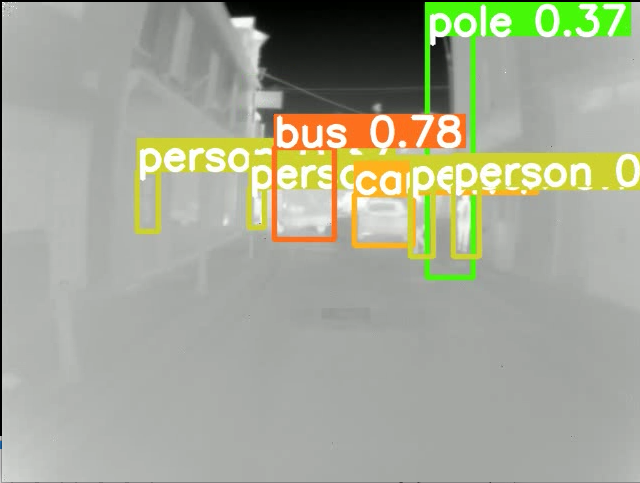

# Thermal-YOLO and TensorFlowLite Optimizatiom
This repo contains all the codes. trained models, optimized version of models using TensorflowLite tool and validatation results

The complete YOLO-v5 folder can be cloned from the follwing github repo link.
https://github.com/ultralytics/yolov5 

The locally acquired C3I thermal automative dataset can be downloaded from IEEE Dataport.
LInk: https://ieee-dataport.org/documents/c3i-thermal-automotive-dataset

1. The complete inference results on public as well as locally acquired datsets can be found in the following link.

https://nuigalwayie-my.sharepoint.com/:f:/g/personal/m_farooq3_nuigalway_ie/EmSY4MawO89Kt_6wsDn_V1YBzeuwLYe6z2b2VU2WJp0b3g?e=wb8IgU 

2. The trained models using all the three optimizers SGD, ADAM and ADAMW can be found in the following link. The link also provided optimized version of the model using TensorFlowLite tool in the SGD model folder.
https://nuigalwayie-my.sharepoint.com/:f:/g/personal/m_farooq3_nuigalway_ie/EoomnUQ1xxNKqPDfCJgtQMsBnGiEaKtUsj8zUMc71EPnhQ?e=vlpjGT 

3. The overall validation/ testing results using different confidence threshold and IoU threshold can be found in the following link.
https://nuigalwayie-my.sharepoint.com/:f:/g/personal/m_farooq3_nuigalway_ie/ErYzIbafONlKl04jTAnpFQkBEK9-B2N350DWgSnk8rIGLw?e=lknp0f
